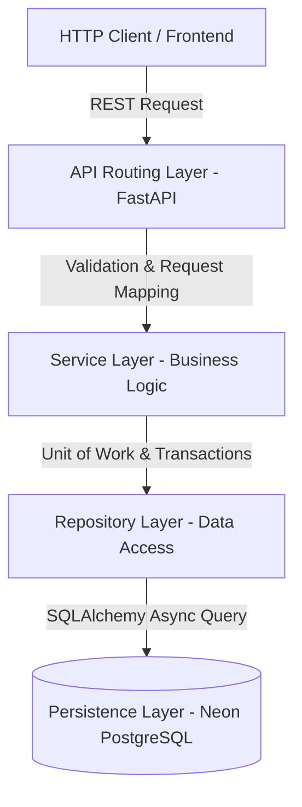

# Backend Architecture — Insight Forge V2

This document details the backend architectural design of **Insight Forge V2**, an enterprise-grade multi-tenant educational intelligence platform.

---

## 1. Architectural Layers

The backend follows a strict separation of concerns across layered boundaries:



### API Layer (`app/api/`)
- Handles HTTP request ingestion, routing, and response serialization.
- Maps exceptions returned by the Service Layer into uniform HTTP responses.
- Exposes versioned endpoints (e.g. `/api/v1/...`).

### Service Layer (`app/services/`)
- Houses the core business rules, multi-tenant validation, and transaction orchestrations.
- Communicates with repositories using generic interfaces.
- Generates DTOs (Data Transfer Objects) instead of exposing database ORM models to the API layer.
- Centralizes the Analytics Engine (performing SQL aggregations, student risk scores classification, and deterministic recommendation rules).

### Repository Layer (`app/repositories/`)
- Manages raw database queries and CRUD mapping.
- Stateless and transaction-agnostic (does not invoke commit/rollback).

### Database Layer (`app/models/`, `app/db/`)
- Stores structural entity definitions, relational mappings, index scopes, and PostgreSQL RLS constraints.

---

## 2. Multi-Tenant Partitioning

- **Isolation Strategy**: Every institutional partner belongs to a unique tenant identified by a `tenant_id` (UUID).
- **Row-Level Security (RLS)**: Enforced directly at the Neon PostgreSQL database engine level using tenant credentials.
- **Tenant Context**: Propagated via the active session during database connection.

---

## 3. Asynchronous Event Loop (Windows Compatibility)

On Windows platforms, `psycopg` async operations are incompatible with the default `ProactorEventLoop`. We globally override this in local runs using the `SelectorEventLoopPolicy`:

```python
import sys
import asyncio

if sys.platform == "win32":
    asyncio.set_event_loop_policy(asyncio.WindowsSelectorEventLoopPolicy())
```
