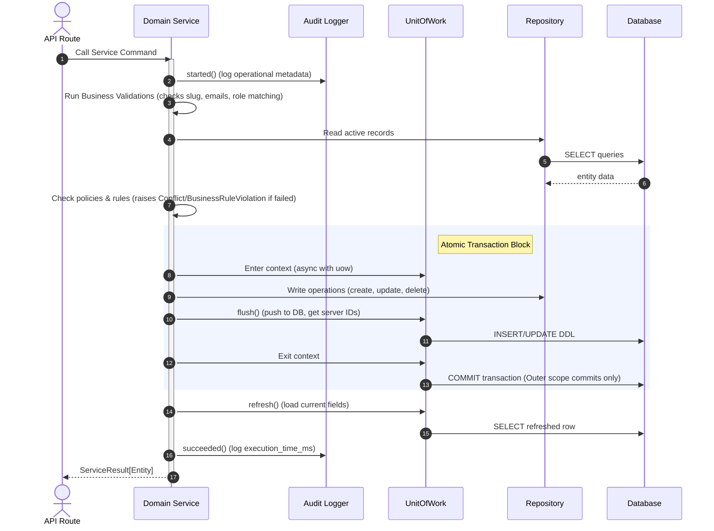

# Service Layer Architecture — Insight Forge V2

This document details the Service/Business Layer architecture, lifecycle execution loops, transaction boundaries, and future extension hooks.

---

## 1. Dependency Graph

The injection flow decouples database configurations from HTTP controller routing:

```
[API Endpoint Router]
         │
         ▼
[Dependency Injection Factory]
         │
         ├───► Instantiates [ClockProvider] & [UUIDProvider]
         ├───► Instantiates [AuditLogger]
         ├───► Instantiates [UnitOfWork] (wrapping [AsyncSession])
         │
         ▼
[Domain Service]
         │
         ├───► Injects Repositories
         └───► Injects [UnitOfWork] & Providers
```

---

## 2. Command Execution Lifecycle

All mutation commands follow a strict validation, write, and logging sequence:



On execution errors:
- `UnitOfWork` context exit calls `rollback()` automatically.
- Service invokes `audit_logger.failed()`.
- Service raises the domain exception (which API mapping middleware converts to HTTP codes).

---

## 3. Dependency Injection Factory

DI factories located in `app/dependencies/services.py` are stateless factory providers wrapping standard FastAPI `Depends`:

```python
def get_user_service(
    uow: UnitOfWork = Depends(get_uow),
    context: ServiceContext = Depends(get_service_context),
) -> UserService:
    return UserService(
        uow=uow,
        context=context,
        audit_logger=DefaultAuditLogger(),
        clock=SystemClockProvider(),
        uuid_provider=SystemUUIDProvider()
    )
```

---

## 4. Integration Extensions & Hooks (Comments Only)

The service infrastructure is planned with clean, decoupled boundary points to support future features without rewriting:

- **JWT Authentication**: Extracted via `ServiceContext` credentials populated in HTTP middlewares.
- **RBAC**: Handled by validating the `context.role` claim against authorization policy maps.
- **Background Tasks**: Hooked via FastAPI `BackgroundTasks` parameters injected in API routes and passed into service execution calls (avoiding heavy workers like Celery).
- **WebSockets**: Integrated by publishing domain event payloads to specific channels on service success hooks.
- **OpenTelemetry & Prometheus**: Enabled by swapping the `AuditLoggerProtocol` to map duration and counter metrics.
- **Redis Caching**: Planned by injecting a swappable caching interface wrapper to check keys before hitting database repositories.

---

## 5. Domain Service Examples

### Command Operation (Mutation)
Commands execute within UoW boundaries, perform validation, and return `ServiceResult[T]`:
```python
async def create_user(self, tenant_id: UUID, email: str, password_hash: str, role: str) -> ServiceResult[User]:
    normalized_email = email.strip().lower()
    async def action() -> User:
        await self._validate_create_request(tenant_id, normalized_email, password_hash, role)
        await self._validate_create_business_rules(normalized_email)
        user = User(
            user_id=self.uuid_provider.generate(),
            tenant_id=tenant_id,
            corporate_email=normalized_email,
            password_hash=password_hash,
            assigned_role=role,
        )
        return await self.repo.create(user)
    return await self.execute_command("create_user", action)
```

### Query Operation (Read-Only)
Queries fetch data directly via repository queries and return results without any envelope:
```python
async def get_user_by_email(self, email: str) -> User | None:
    return await self.repo.get_by_email(email.strip().lower())
```

