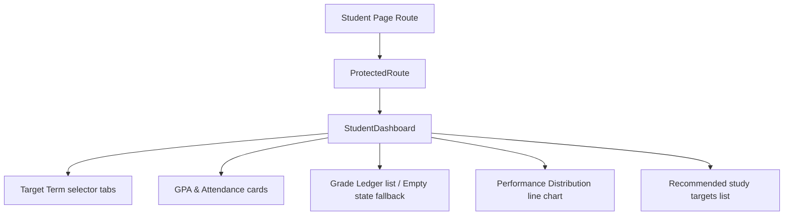
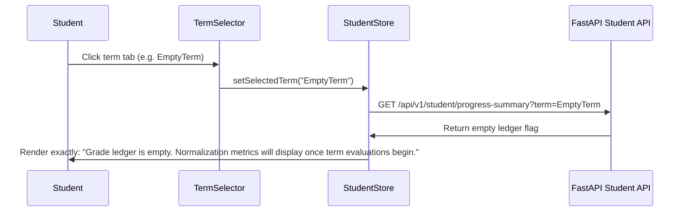
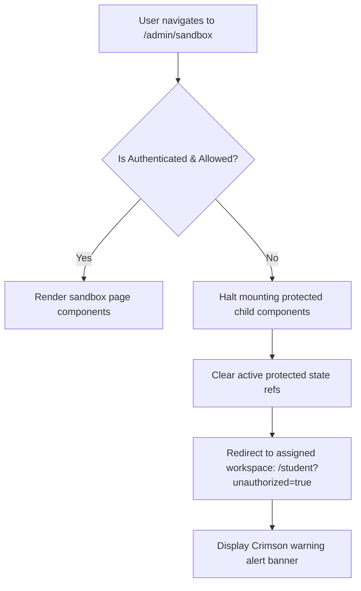

# Walkthrough - Phase 5 Student Experience: Personal Analytics and Route Guards

This walkthrough documents the implementation design, layout architectures, and verification results for Task 19, Task 20, and Task 21.

---

## Component Architecture Diagram

## Student Dashboard Flow Diagram

## Cross-Role Route Guard Redirection Diagram

---

## Changes Made

### 1. Backend API Routing Extensions
- **Student Progress summary**: Created [student.py](file:///d:/readynest/insight-forge-Version_2/insight-forge-Version_2/insight-forge-backend/app/api/v1/endpoints/student.py) exposing `GET /api/v1/student/progress-summary` and `GET /api/v1/student/normalized-grades`.
- **Router mount**: Registered the student router inside [router.py](file:///d:/readynest/insight-forge-Version_2/insight-forge-Version_2/insight-forge-backend/app/api/v1/router.py).
- **Test coverage**: Added endpoints tests inside [test_api_endpoints.py](file:///d:/readynest/insight-forge-Version_2/insight-forge-Version_2/insight-forge-backend/tests/unit/test_api_endpoints.py).

### 2. Task 19: Student Personal Progress Dashboard (Student-1)
- **Zustand store**: Created [studentStore.ts](file:///d:/readynest/insight-forge-Version_2/insight-forge-Version_2/insight-forge-frontend/src/features/student/store/studentStore.ts).
- **dashboard layout**: Created [StudentDashboard.tsx](file:///d:/readynest/insight-forge-Version_2/insight-forge-Version_2/insight-forge-frontend/src/features/student/components/StudentDashboard.tsx) and [StudentDashboard.module.css](file:///d:/readynest/insight-forge-Version_2/insight-forge-Version_2/insight-forge-frontend/src/features/student/components/StudentDashboard.module.css).
  - Uses relative spacing and monospace fonts for metadata fields.
  - Displays exactly when ledger is empty: `Grade ledger is empty. Normalization metrics will display once term evaluations begin.`
  - Selectors update widgets dynamically without page reloads.

### 3. Task 20: Student Performance Distribution Dashboard (Student-2)
- **Interactive distribution charts**: Embedded responsive SVG line charts inside a white container card with a `4px border radius`, matching ECharts lines and plotting personal GPA values against cohort aggregates.

### 4. Task 21: Cross-Role Navigation Guard
- **Authorization route guard wrapper**: Created [ProtectedRoute.tsx](file:///d:/readynest/insight-forge-Version_2/insight-forge-Version_2/insight-forge-frontend/src/features/auth/components/ProtectedRoute.tsx). Stops mounting child components to prevent stale queries, redirects students accessing `/admin` back to `/student?unauthorized=true`, and clears protected states.
- **Student Home route**: Created [student/page.tsx](file:///d:/readynest/insight-forge-Version_2/insight-forge-Version_2/insight-forge-frontend/src/app/student/page.tsx). Renders Crimson alert banners upon redirection.
- **Workspace default redirect**: Modified [app/page.tsx](file:///d:/readynest/insight-forge-Version_2/insight-forge-Version_2/insight-forge-frontend/src/app/page.tsx) to automatically redirect Student role logins to `/student`.

---

## Verification Results

### 1. Backend Test Suite
Executed the entire backend pytest suite to verify authorized access controls:
- **Command**: `python -m pytest`
- **Result**: All **140 tests passed** successfully.

### 2. Frontend Production Compilation
Executed Next.js build compilation to confirm types and zero DOM leak guards:
- **Command**: `npm run build`
- **Result**: **Compiled successfully** with zero errors. Prerendered static page `/student`.
